## A $30,000 first year | Background

Combat is the clothing company I started with my best friend Abdul. We taught ourselves graphic design, built the store, and grew a simple idea to thirty thousand dollars in revenue. Each piece began as a story before it became clothing, and stories deserve pages, so the year ended with a sixty-eight page journal.

## The Soldier Uniform | Soldier

In *The War of Art*, Steven Pressfield describes the artist as a soldier at war with the Resistance, which is everything that keeps you from honing your craft and bringing your gift into the world. Most people quietly lose that battle. This piece was designed as a daily reminder to fight in defense of your gifts, to be worn wherever you train: the studio, the library, the gym. The quote on the woven label is Nietzsche.

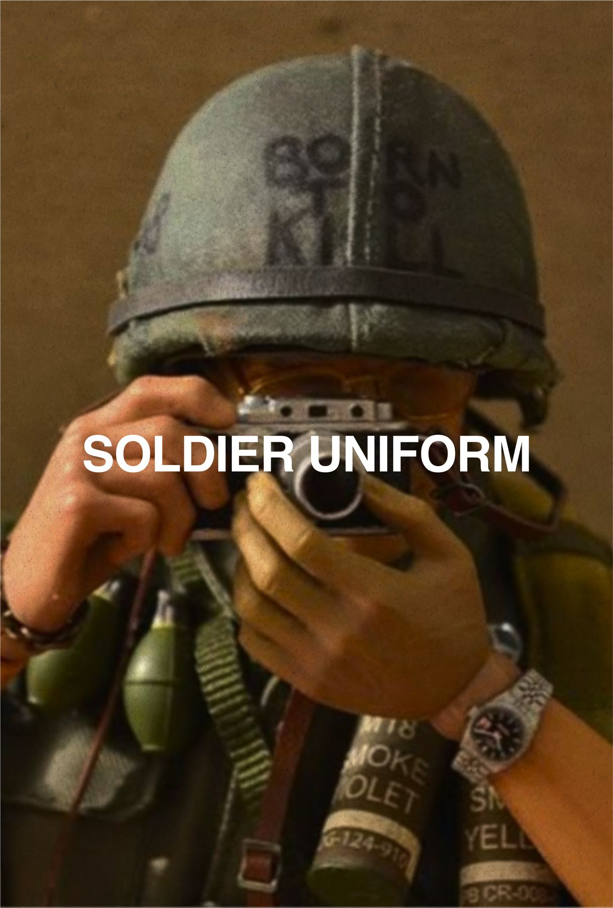 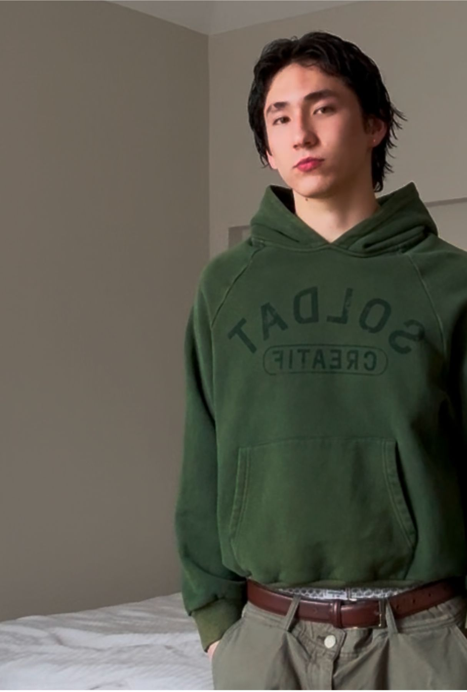 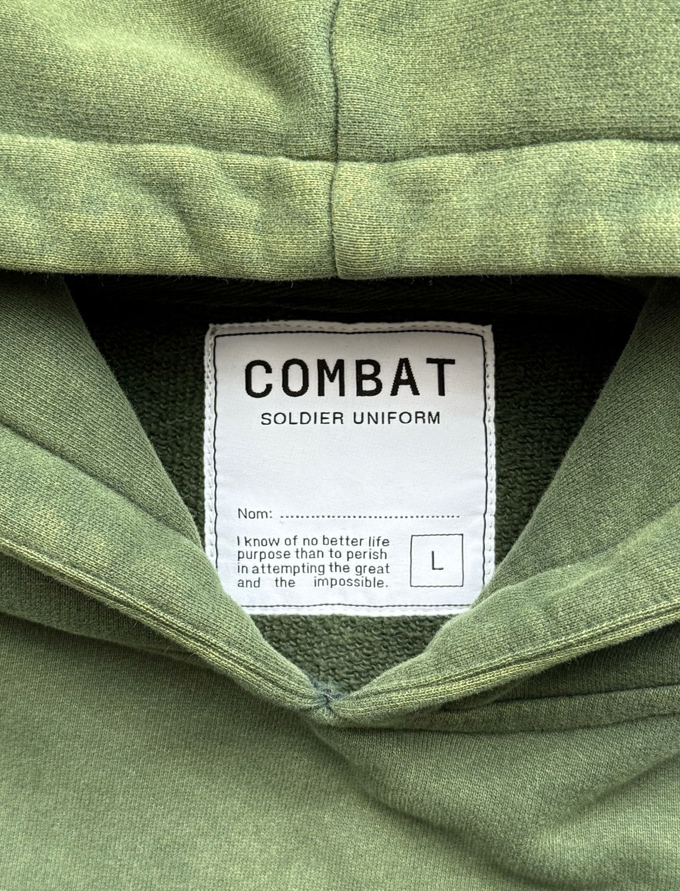

## The Workshirt | Workshirt

LockedIn started as an Instagram comment on a post making fun of LinkedIn. The comments were full of people venting about how soul-sucking their corporate lives had become, and I suggested something more human. Virgil Abloh talked about the three percent rule, that altering an existing design by three percent creates something new. We took a classic white-collar shirt and made two changes: a LockedIn logo on the front pocket, and a quote about working with love stitched into the back collar.

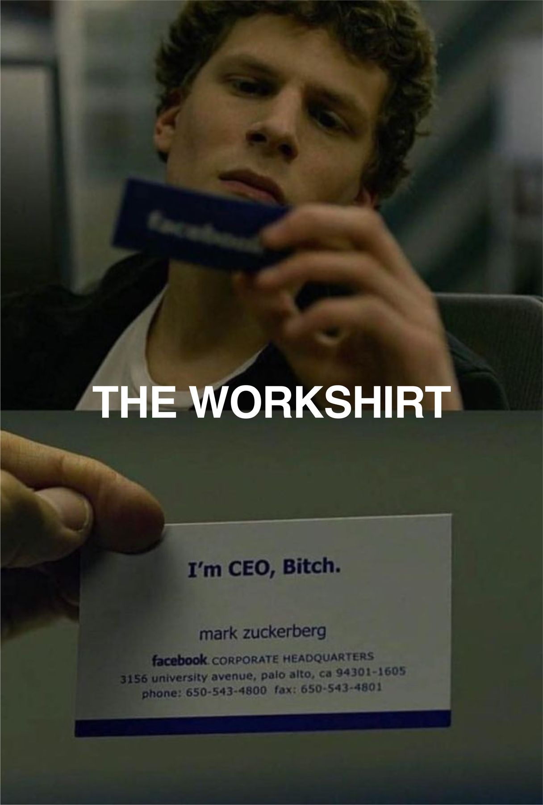  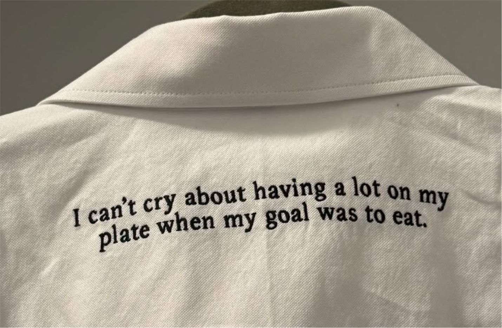

## The Playfight Crewneck | Playfight

Frank Lifshitz dreamed of being an artist and ended up painting houses to feed his kids. He changed the family name to Lauren, and his son built one of the most iconic American labels out of nothing but taste and ambition. The crewneck is a knit in that tradition, made to capture the joy of being a kid and playfighting, the kind of loving conflict that disappears too early in life.

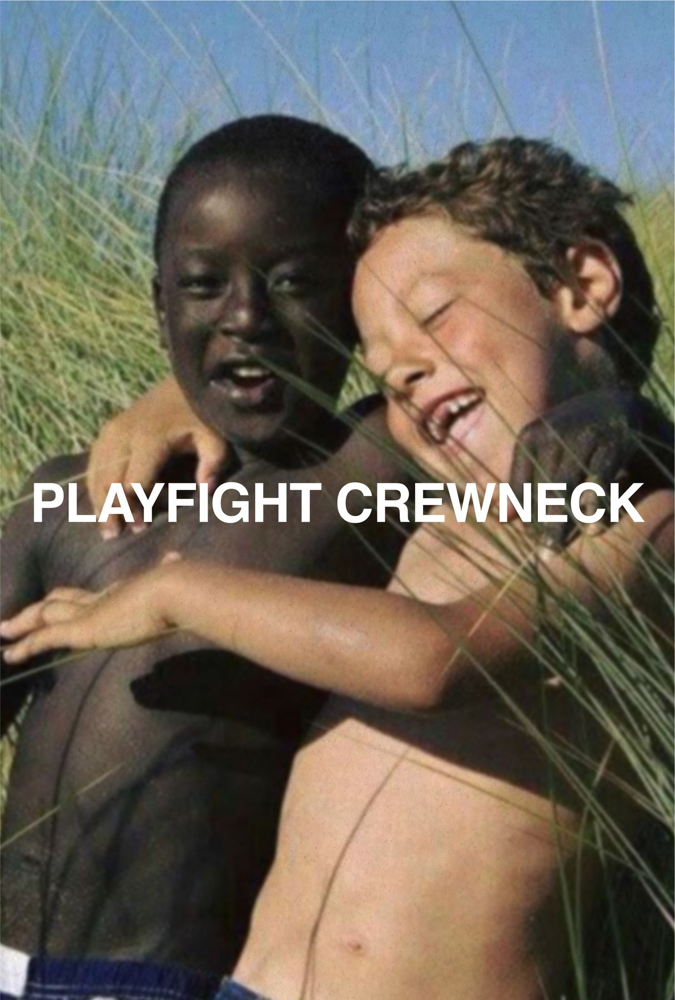 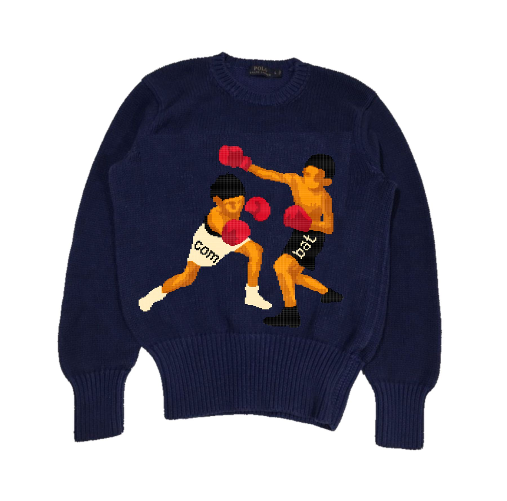 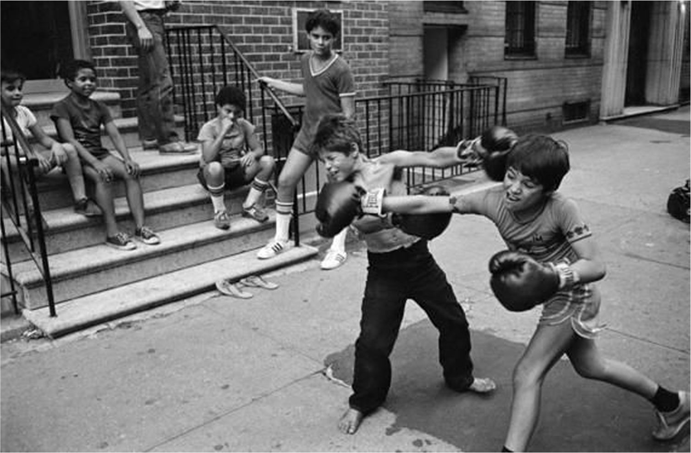

## The Neighborhood Tee | Neighborhood

I did my sixth grade history project on Jean-Michel Basquiat. I remember looking through photographs of New York's 1980s art scene and being so fucking jealous that these brilliant minds all lived in the same city, sharing ideas and working together. The neighborhoods were full of artistic, troublesome kids, graffiti writers, b-boys, poets, rappers, and they did their shit the way birds sing. Where I grew up, that didn't exist. The tee pays homage to the neighborhoods and artists that shaped a worldview.

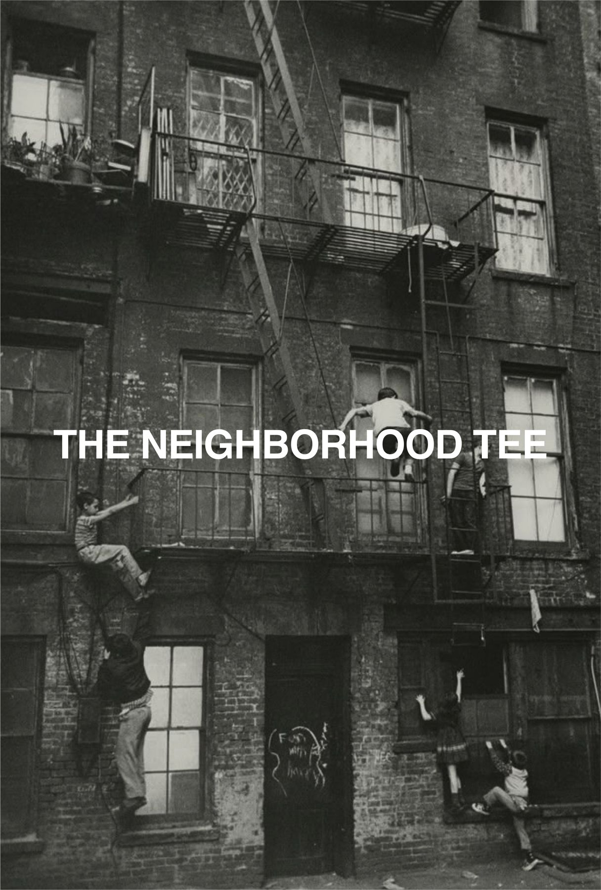 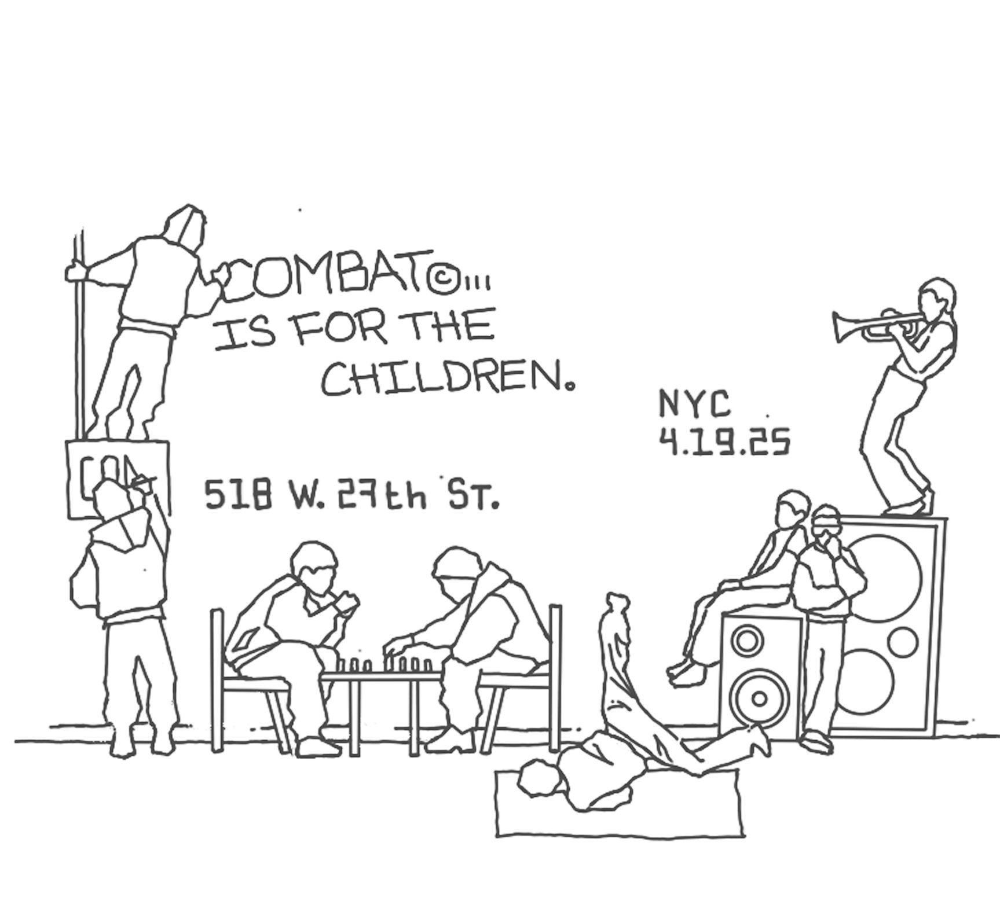 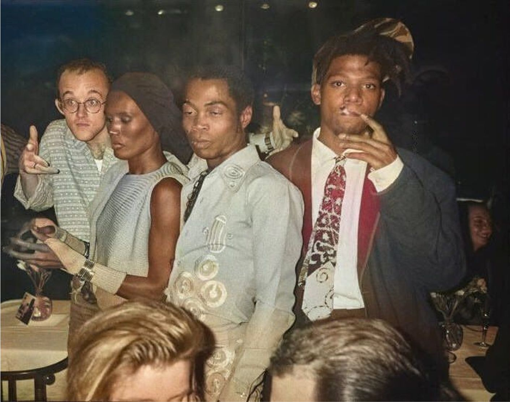

## Combat Journal, Vol. I | Journal

Sixty-eight pages on making things with your friends: the four garments, the stories behind them, and the people who wore them. Written, shot, and laid out start to finish. The whole issue is here, page by page.

                                                                    
