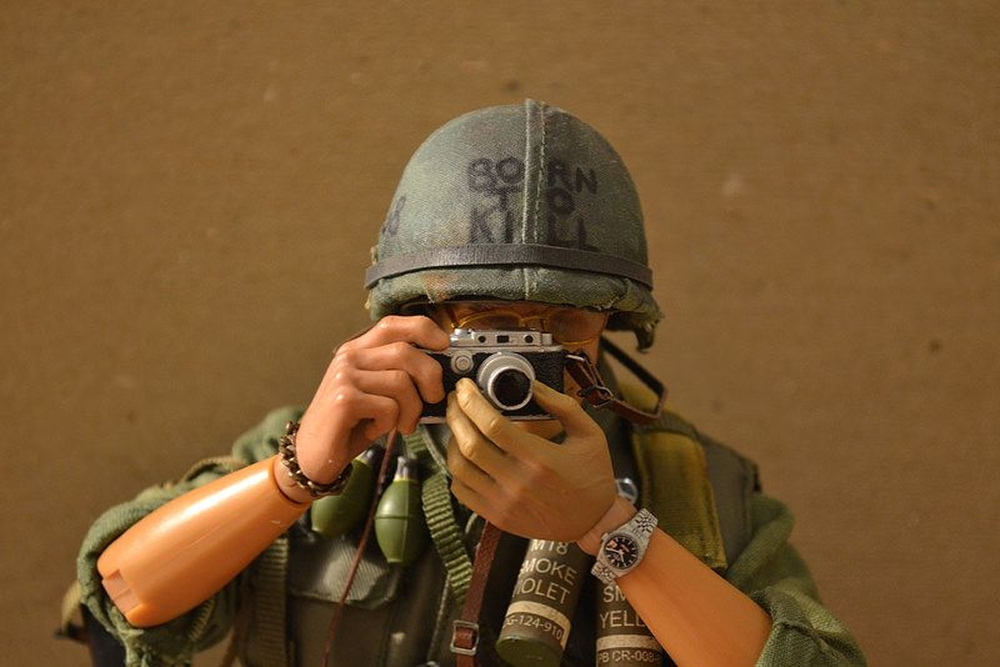
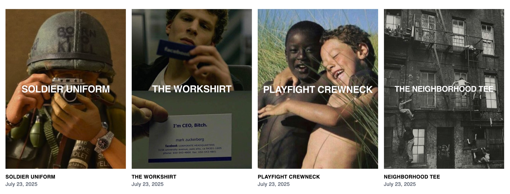
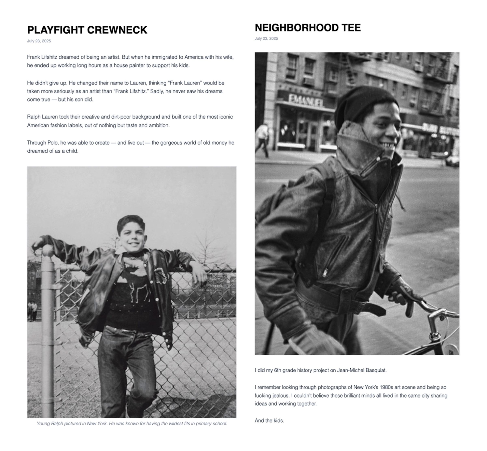
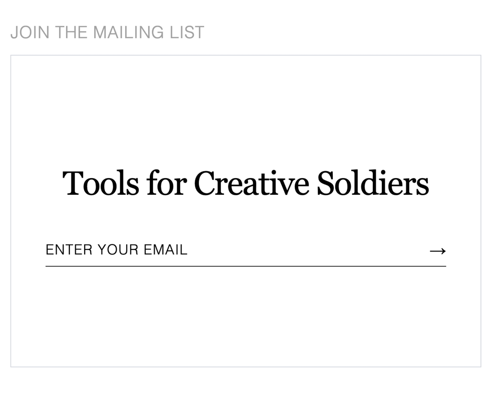
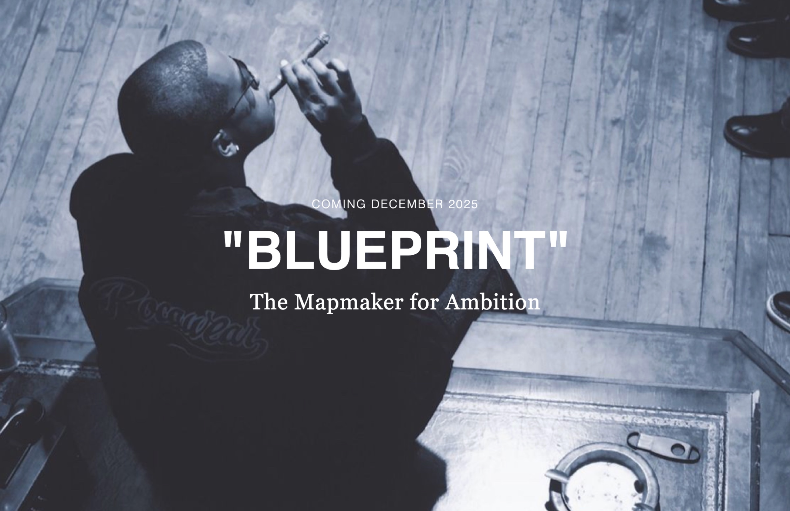
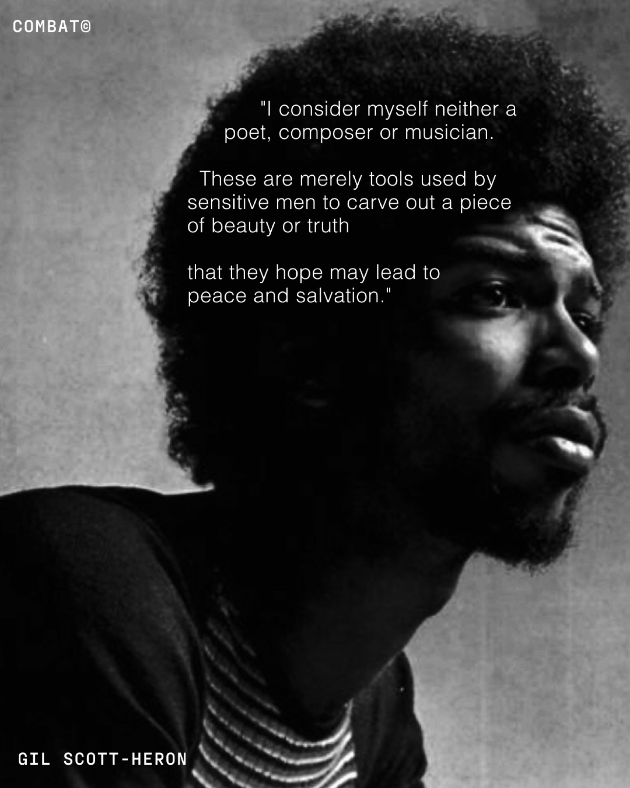
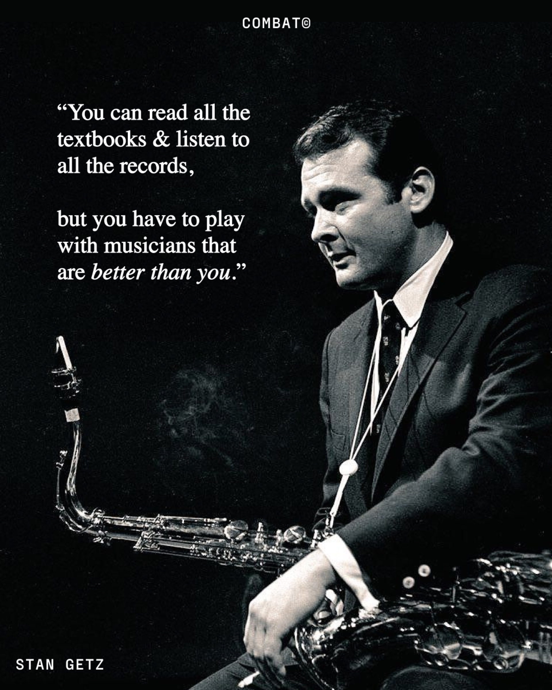
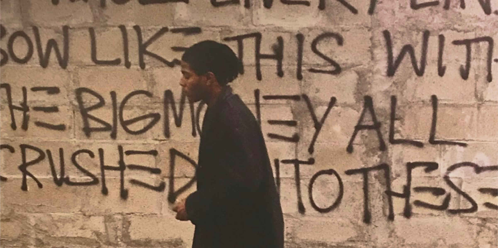

Combat is a creative community and clothing brand built around the idea that true beauty comes through struggle. As it grew from an Instagram page into a brand releasing clothes, publishing a magazine, and hosting events, it needed digital infrastructure to match. I built the site on Shopify: a product system where every release ships with an editorial article explaining it, a curated library for visual inspiration, and email capture to move the audience somewhere we own.

The journal was digitized into the same system — each garment's story published as a chapter, so the print magazine and the store read as one body of work.

 

The library is the brand's taste made navigable — films, records, books, and tools, sortable by *watch*, *read*, *listen*, and *use*.

Releases are announced as teasers and collected by email, and the same art direction carries through the social feed.

 

  

