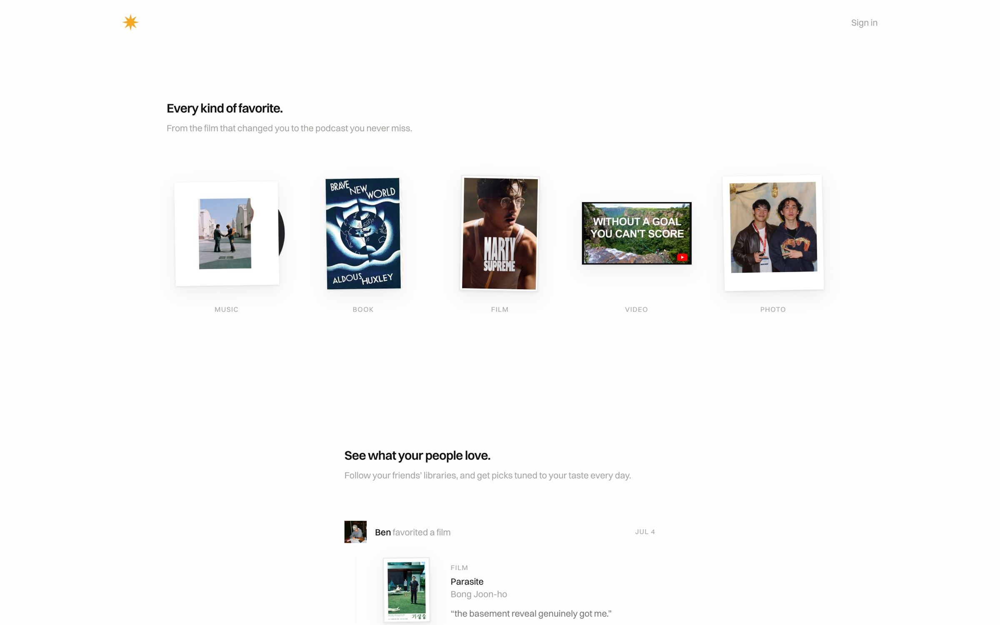
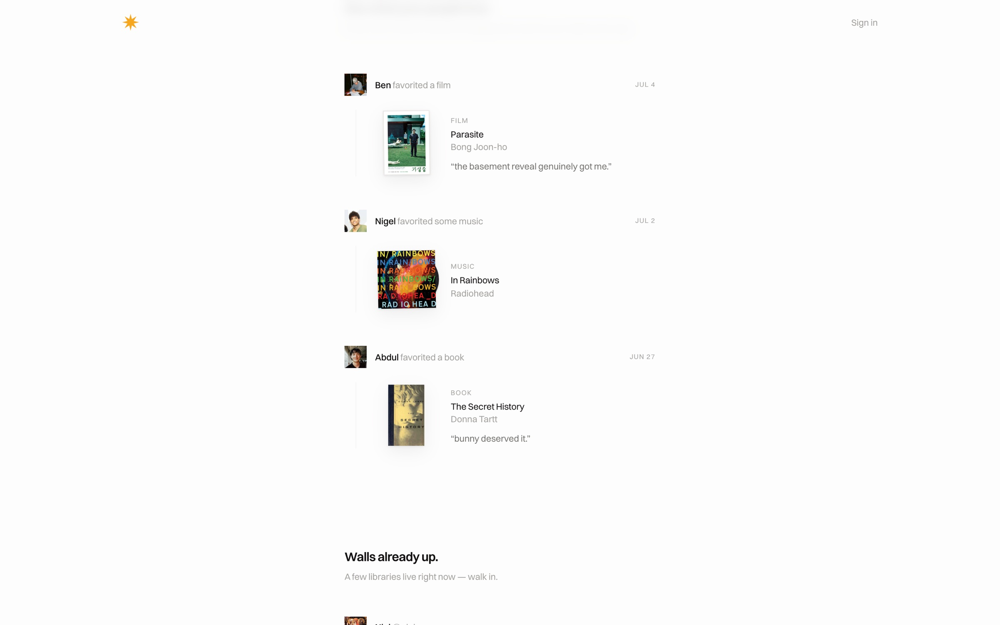
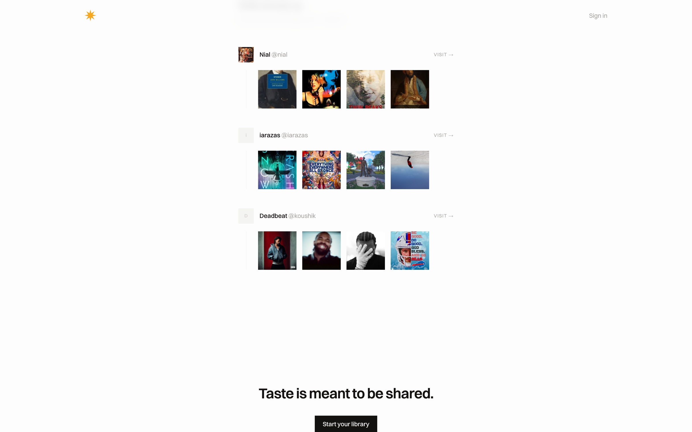
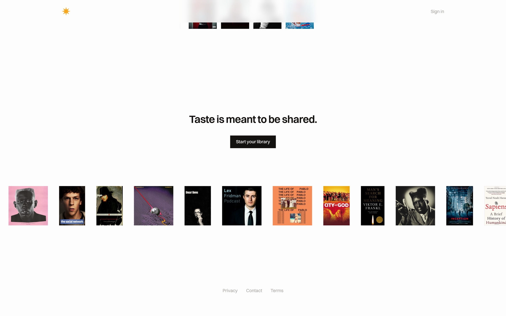
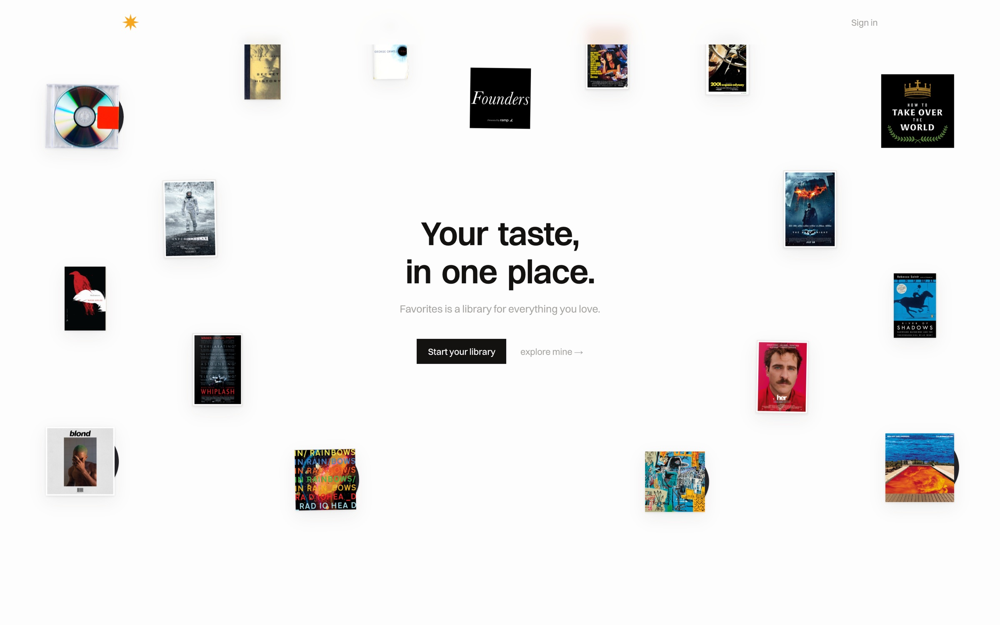

Favorite is a library for everything you love. Every reference that shaped you — the film that changed you, the record on repeat, the book you press into people's hands — collected on one shelf, in one place. Abdul and I built it together, and it opens the way a library should: your covers flash past like a deck being shuffled, then the wall reveals itself.

Search pulls clean covers and metadata for anything — film, TV, music, books, podcasts, video — so a library builds itself in minutes and looks like a wall worth staring at.

Taste grows socially. You follow your people, see what they save and what they say about it, and the feed uses AI to tune daily picks to your taste — less algorithm slop, more "your sharpest friend told you to watch this."

 

 

The site is live — walk into a few libraries.

