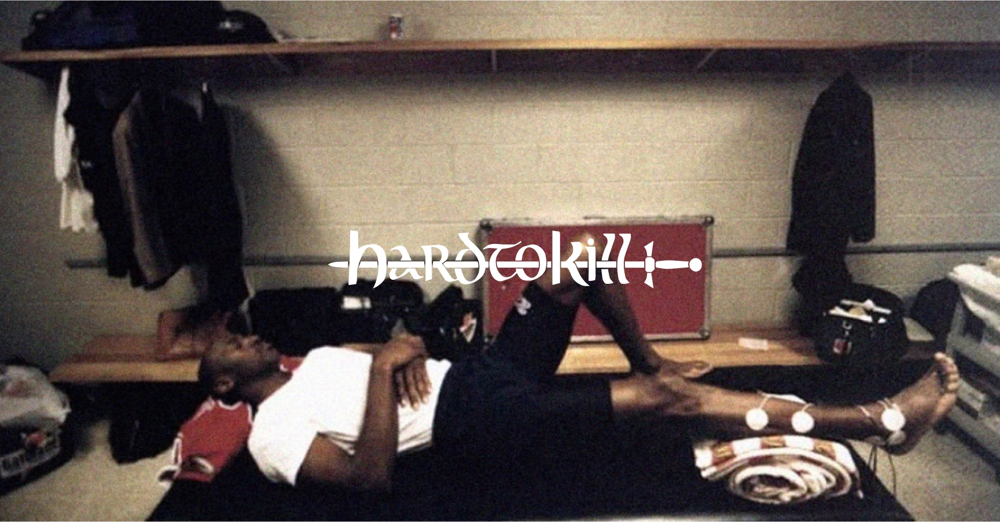
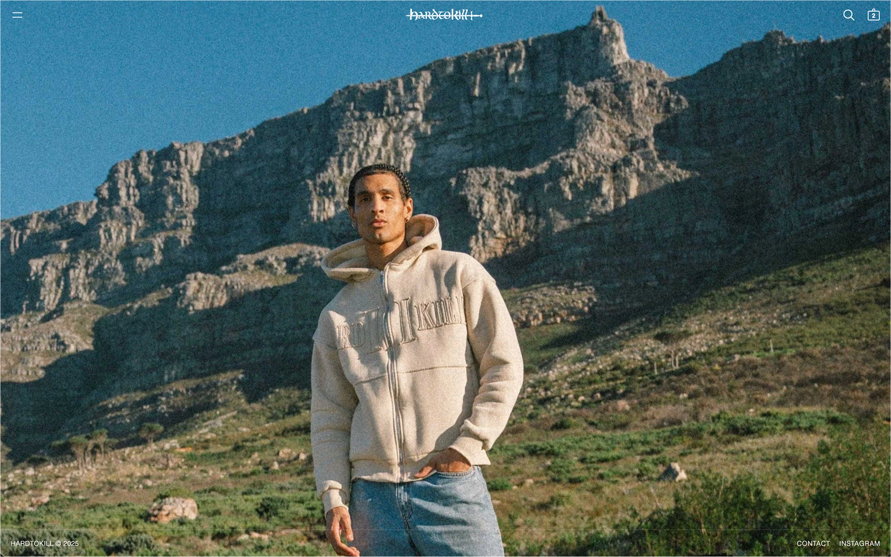
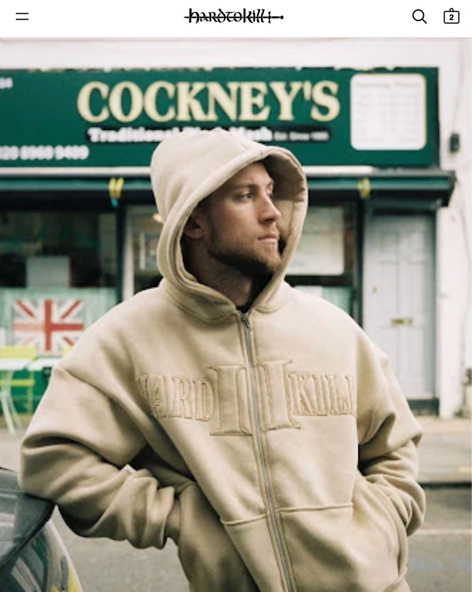
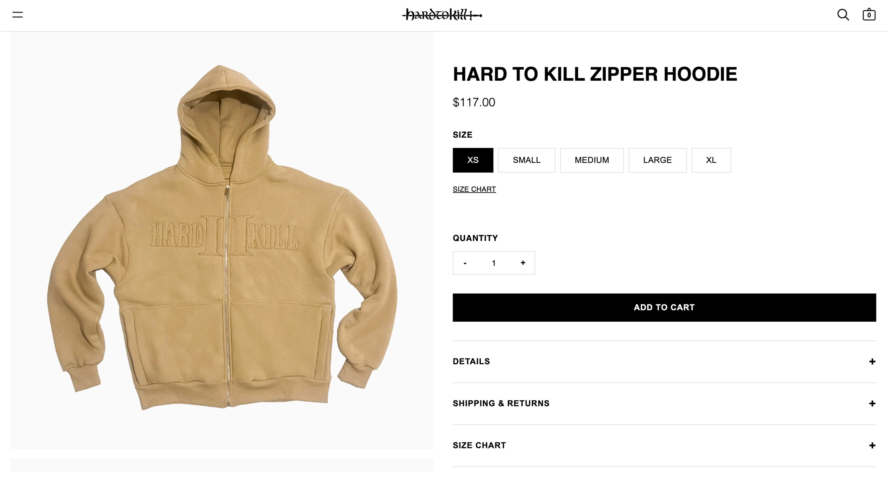
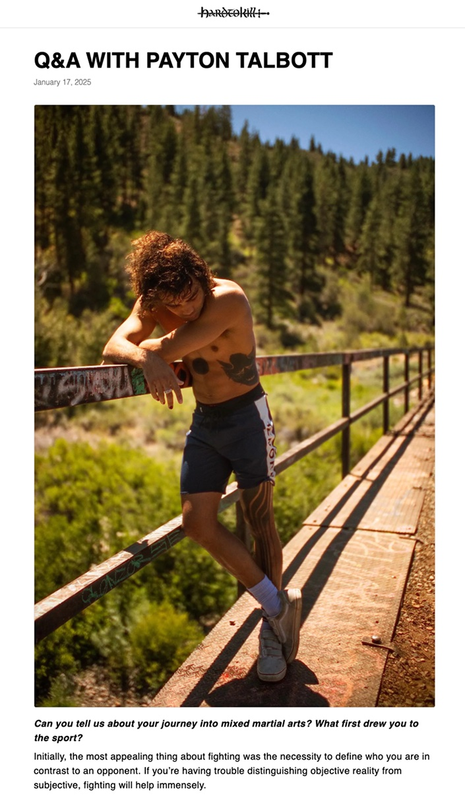
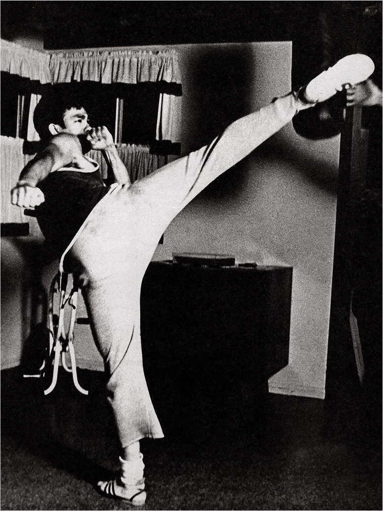
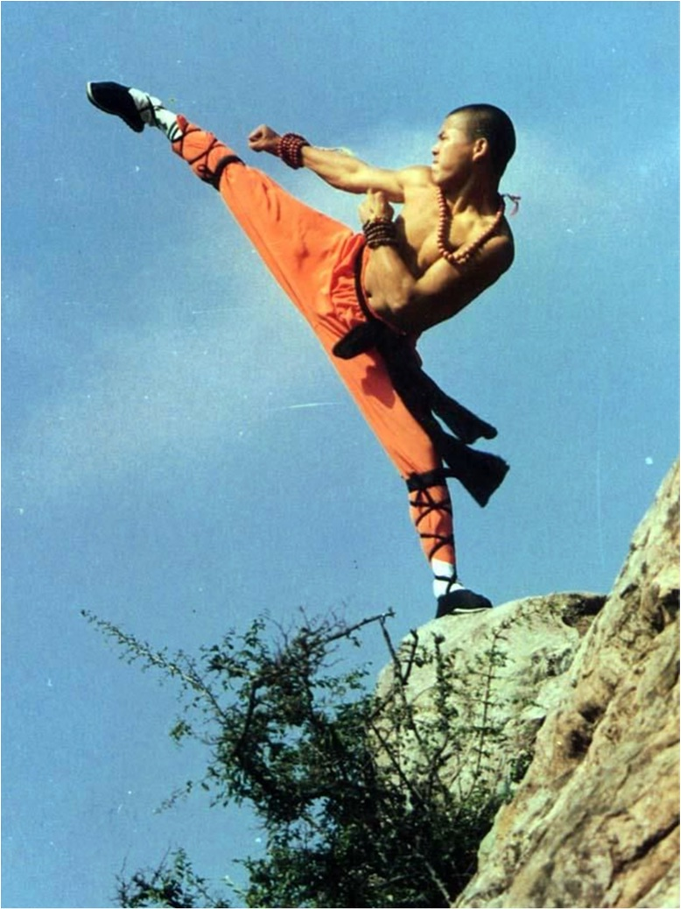
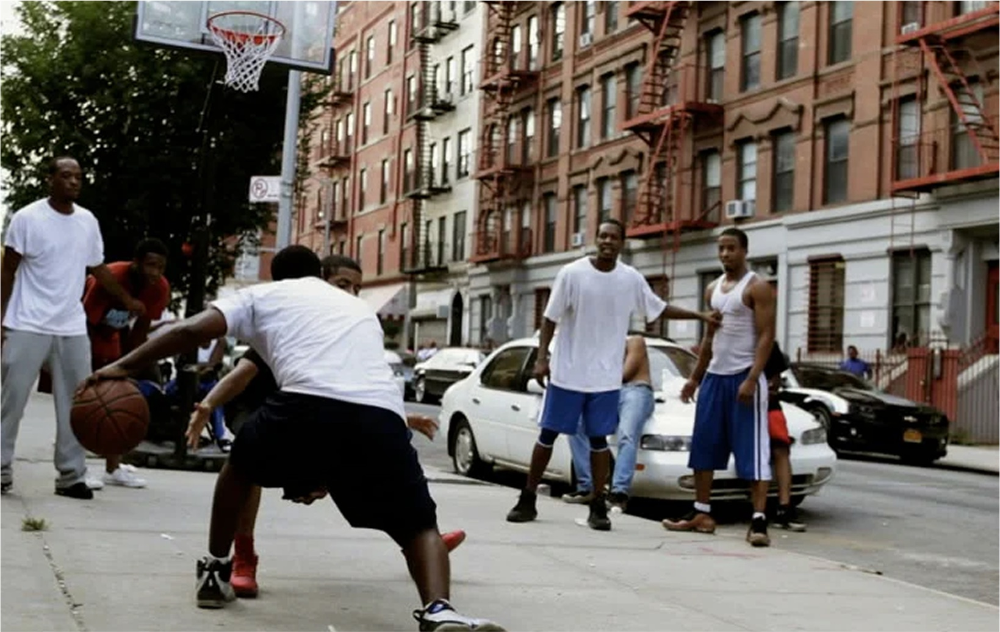

Hardtokill is a media company built around triumph and resilience. Over four years they grew to 340k followers curating powerful imagery and interviews with people who embody their ethos — UFC fighters, artists pushing boundaries. As they became a full media business they needed infrastructure: product drops, editorial content, community. I built them a Shopify-integrated site with a dynamic CMS for both media and products, email capture for releases, and a design quiet enough to let their aesthetic lead.

The hero had to carry the brand's whole mood before a single product appears — one photograph, the blackletter wordmark, nothing else asking for attention.

 

Everything editorial and commercial runs through Shopify's CMS, so the team publishes drops and interviews without touching code — the Q&A series lives in the same system as the product pages.

 

The photography they spent four years curating carries through every page; the interface stays out of its way.

  

