## Overview

Marble began as a question: what would a training app look like if it treated the body the way philosophy treats the mind — as something sculpted deliberately, over years, with taste. Most fitness software is a spreadsheet wearing a neon jacket. Marble is built from the opposite instinct.

The name is the thesis. The work is already inside the block — training is just removing what isn't.

## The Identity

The posters came before the product. One word, set plain, over the people and the stone that Marble is named for — Bruce Lee, Mishima, Ali, Michelangelo's slaves — with a line from Alexis Carrel underneath: *man cannot remake himself without suffering, for he is both the marble and the sculptor.* The app had to live up to them.

  

  

  

                    

## The Product

The interface strips training down to its essential rhythm. No streaks, no confetti, no gamification — a single daily surface that knows what today is for, closer to a notebook than a dashboard. Each day opens on a line worth reading, a button, and your programs.

 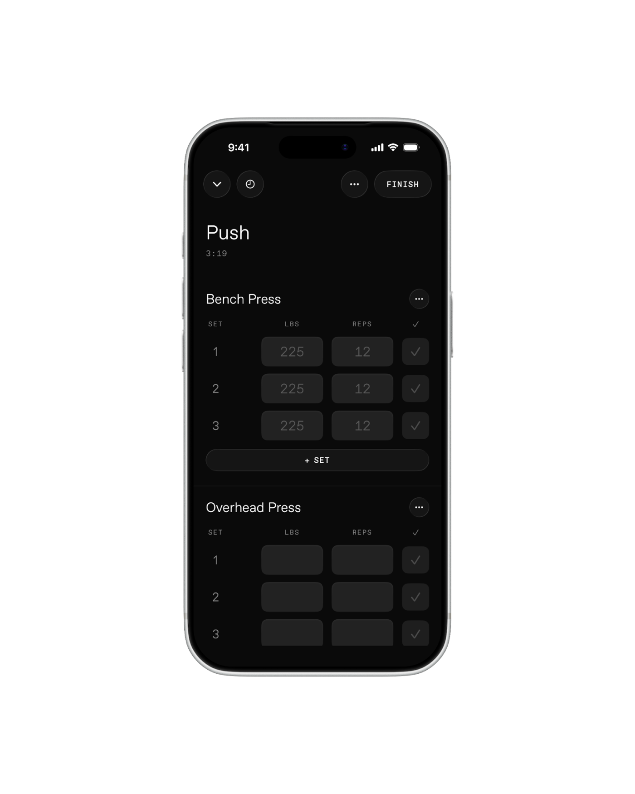 

A workout is a list of sets. Weight, reps, done. Tick a set and the rest timer starts itself; the next row pre-fills from the last, so the screen asks as little of you as the bar does.

  

Leave mid-workout and it folds into a pill above the tabs, timer still running — Marble never makes you choose between looking something up and losing your place.

 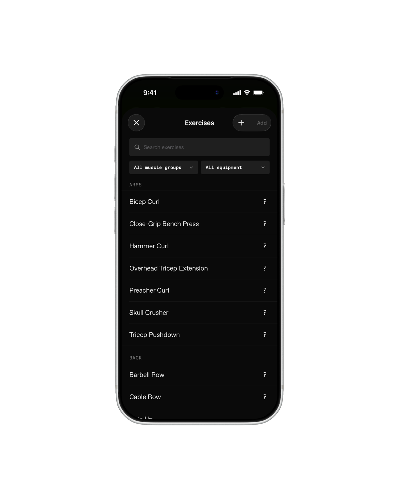

Track is where the numbers live — the month as a grid of days, bodyweight, best lifts. You is the record of it all: a journal of training days, each with a photo and a line about how it went.

 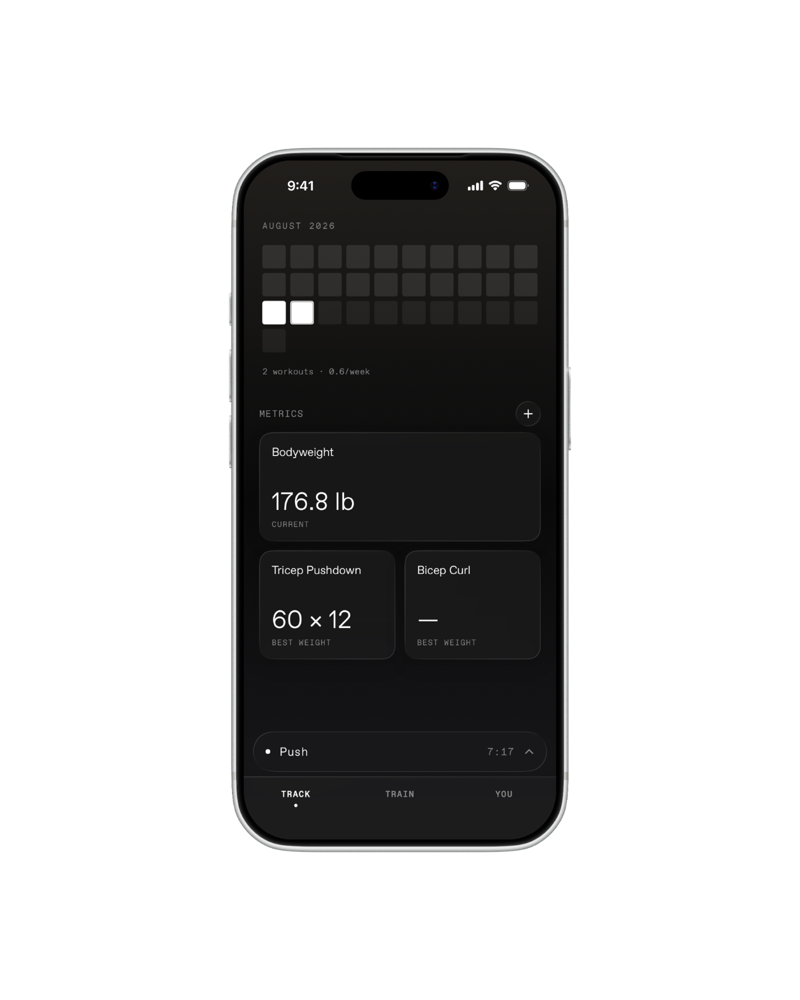 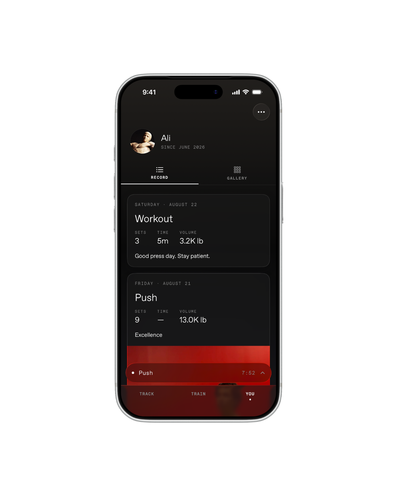

 

The session doesn't end on a chart. It ends on a page that says *Recorded*.

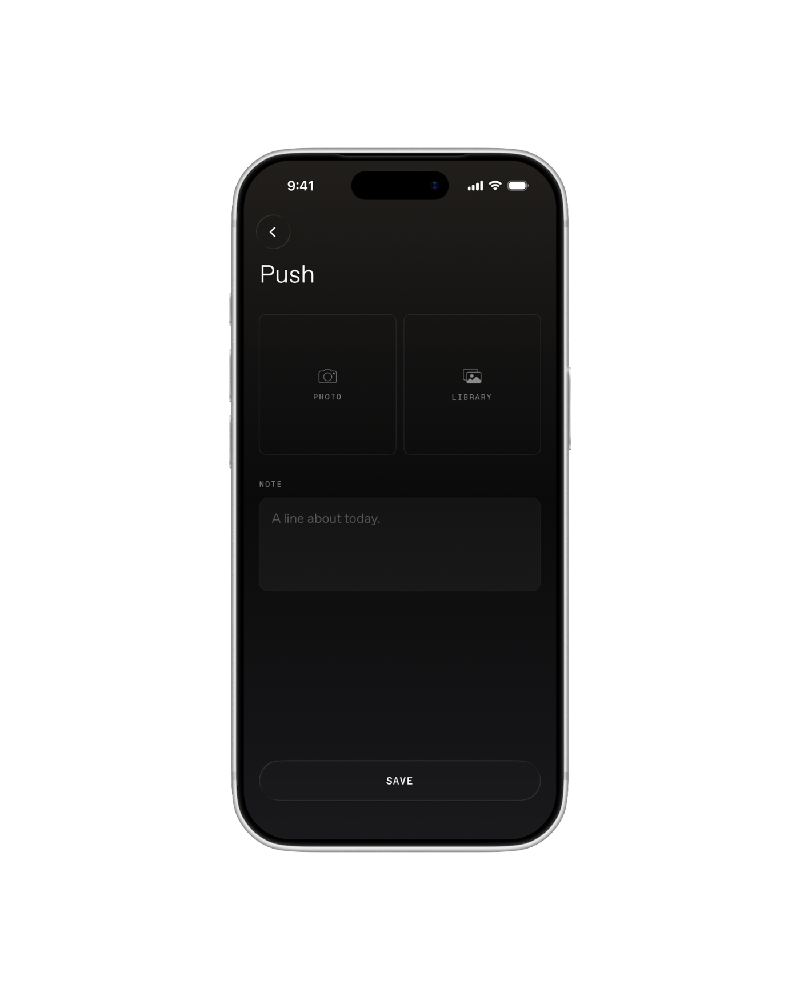  

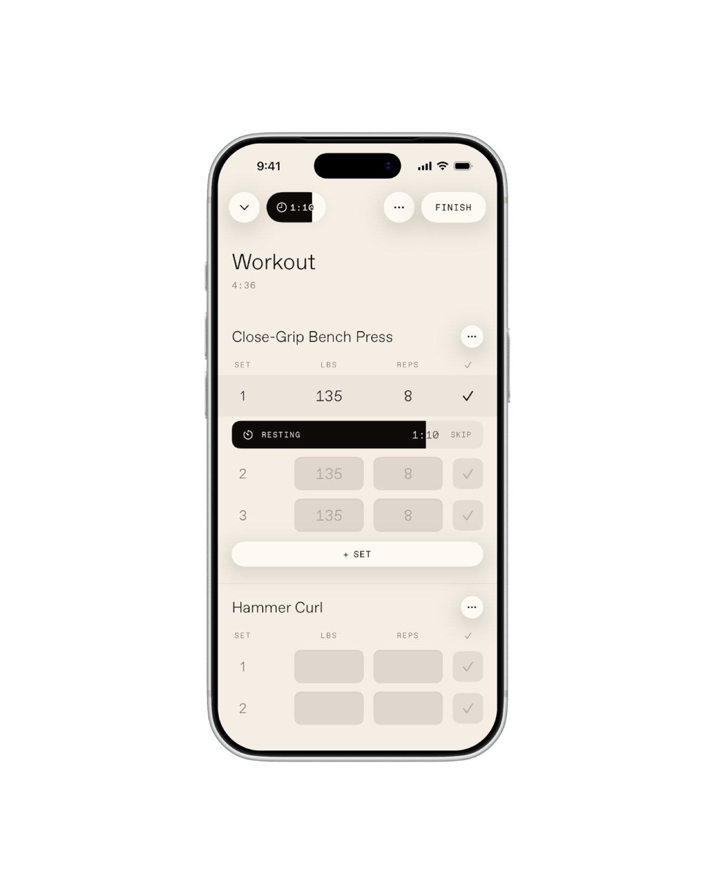 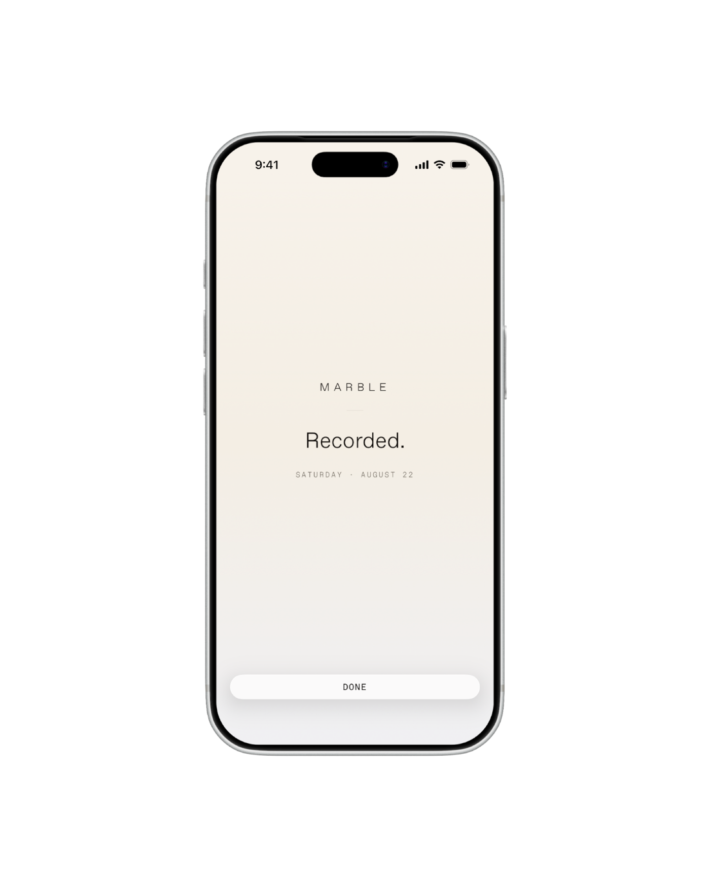

The site carries the same restraint: one statue, one sentence, one button.

 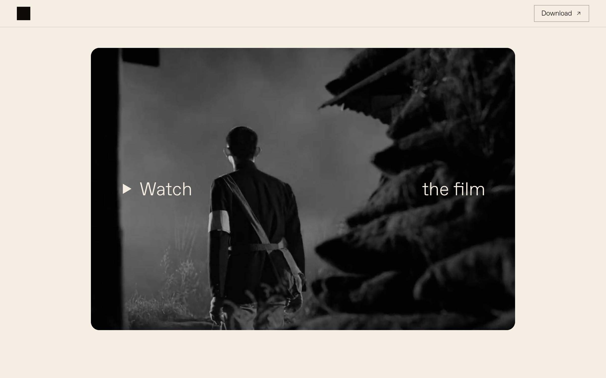 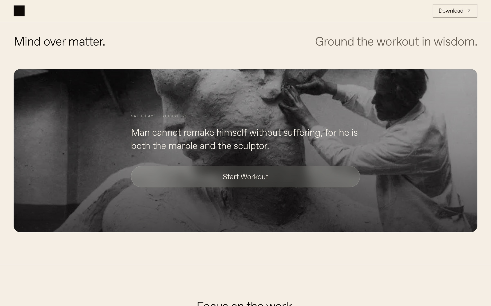 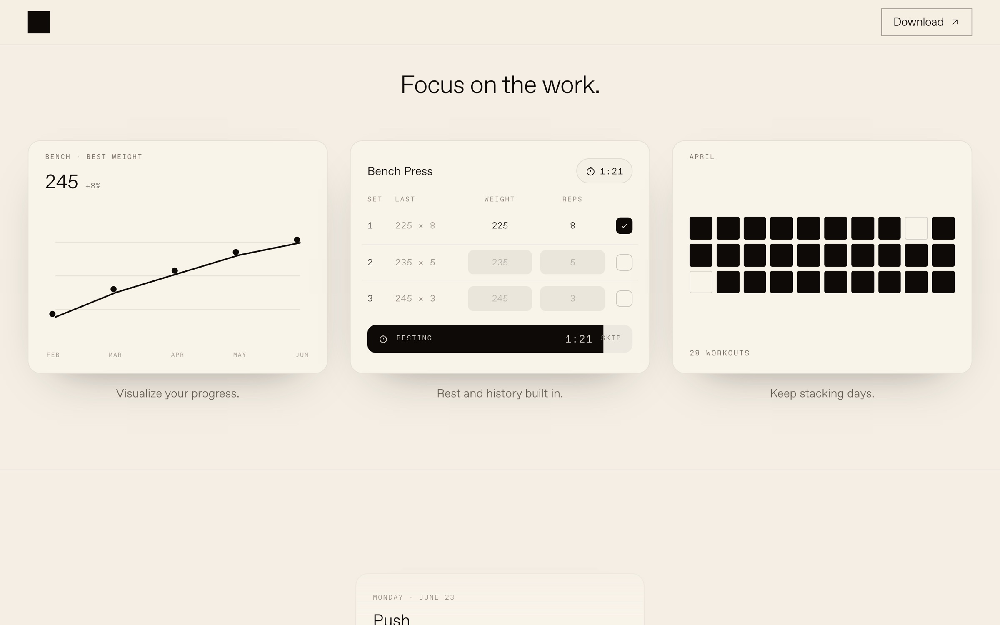 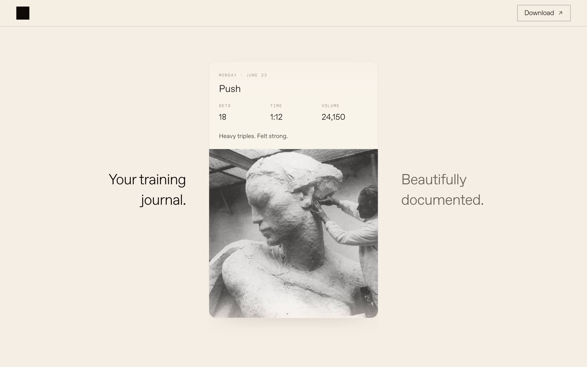 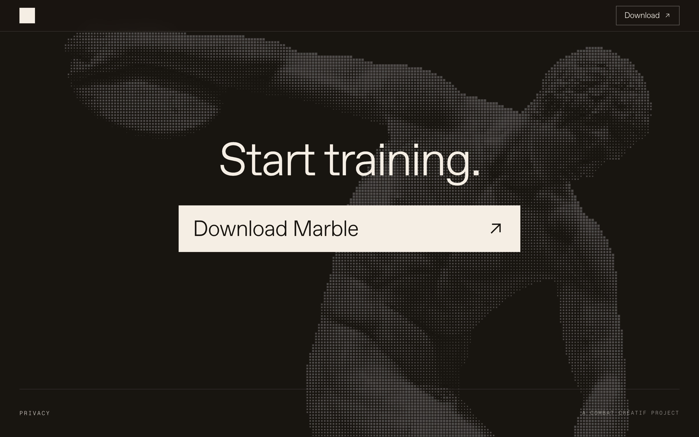

Marble ships to beta in summer 2026.
