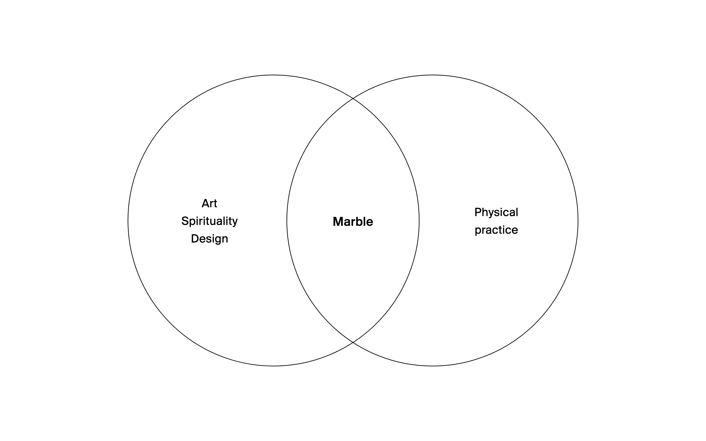
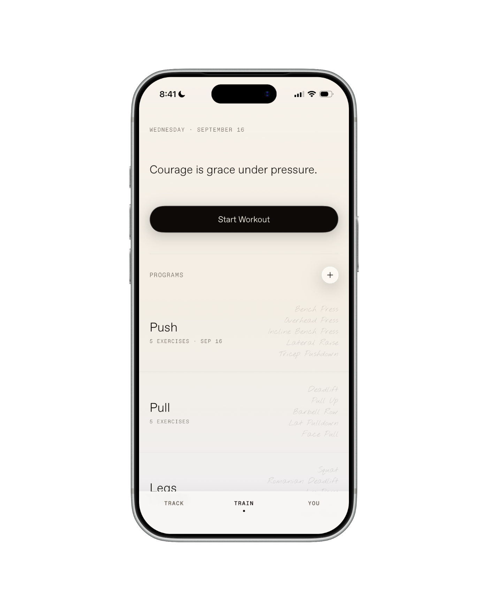
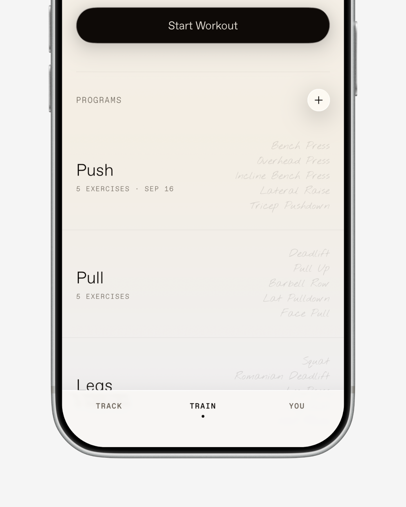
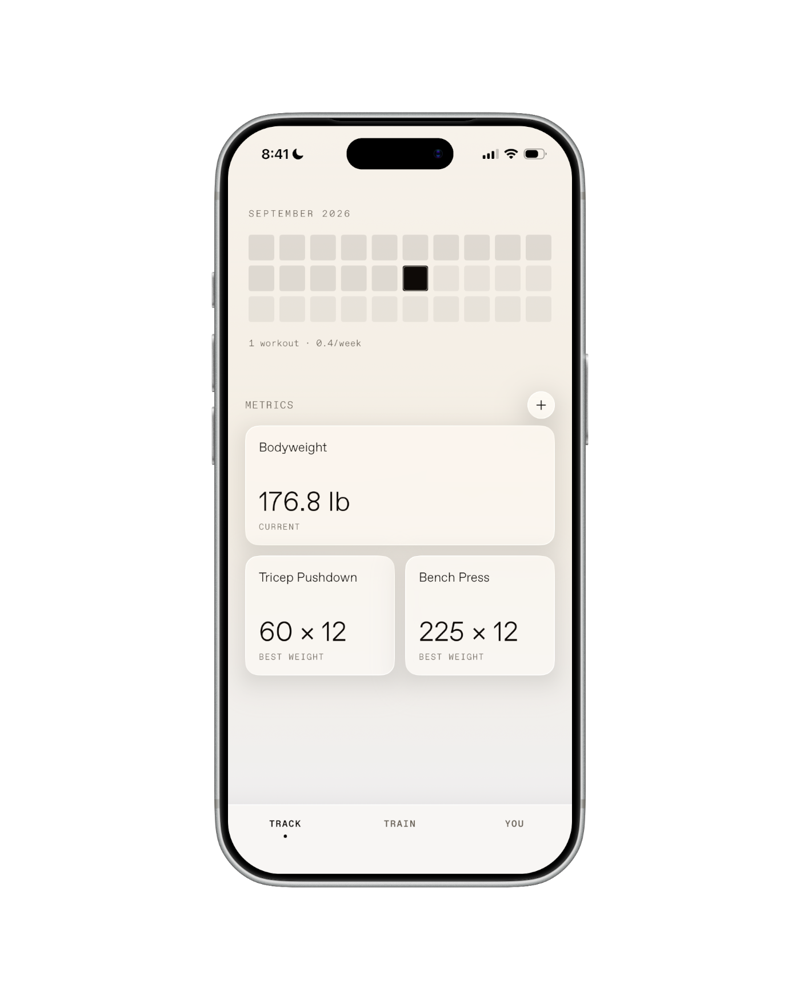
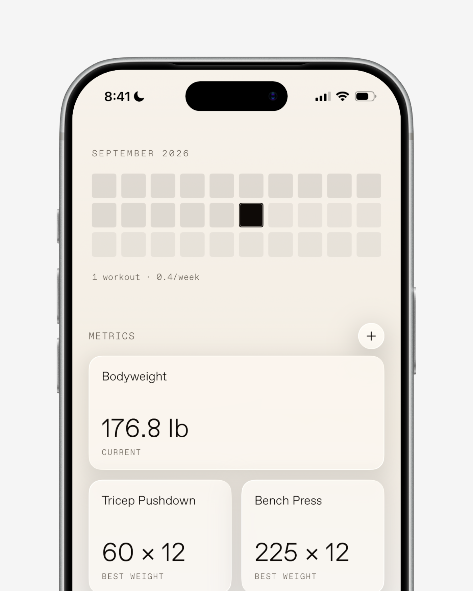
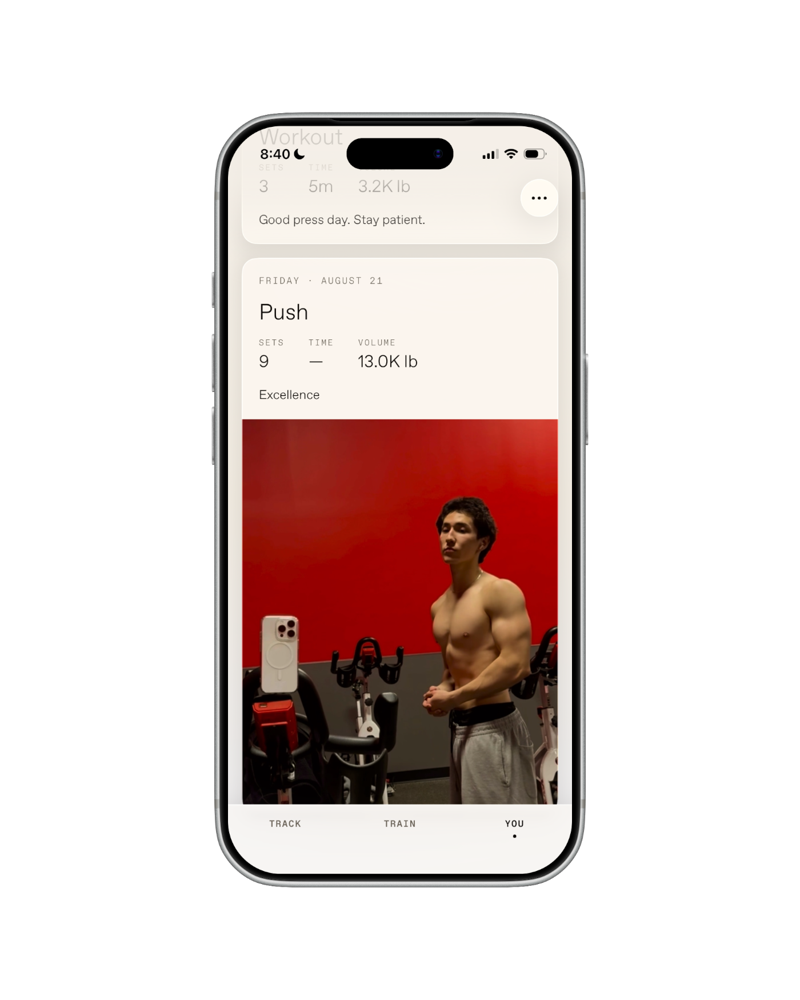
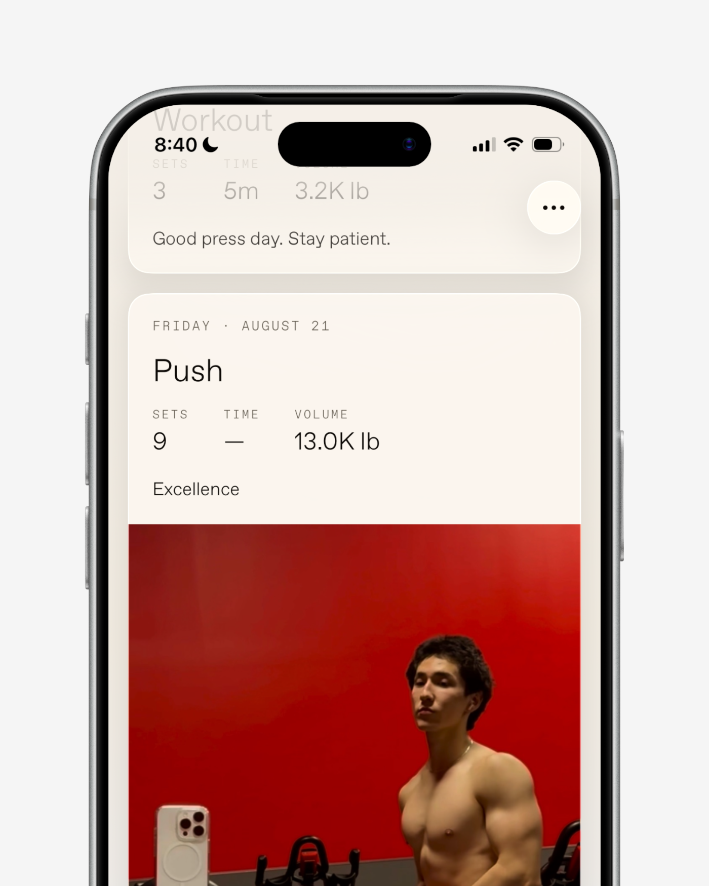

## No awe | Background

Marble started in January. My ambitions for the year were to make beautiful products and to cultivate a fighter's physique. The two pursuits merged into Marble, an attempt at the most beautiful training app in existence.

I know from experience that if I don't track my food and my lifts, progress gets amorphous and I plateau. So I looked at the apps I was using: Strava, MyFitnessPal, MacroFactor, Strong. Not one of them made me feel any awe at how beautiful the program was, or feel the way I wanted to while training. Strava is orange and social and full of noise. MyFitnessPal, listen to the name. They're general fitness apps, and a general fitness app doesn't really benefit from a specific take.

I wanted two things:

- To track everything required in physical transformation: food, weight, lifts, progress photos.
- A product with a point of view built into the name, the branding, and the design, so that any engagement with the tool recalled emotions and ideas that inspired me to pursue physical greatness.

## The durable fuel | Motivation

I started lifting because I wanted to look good. This is quite motivating, but a sharp, narrow, obviously vain motivation which often burns off. After my initial push to lose weight and stop getting rejected by girls in middle school, my inspirations to train changed and merged with my creative interests.

Before workouts I'd sit with my pre-workout and go through a Pinterest board I kept full of Greek statues, Seneca excerpts, snapshots of Jordan, Kobe, Muhammad Ali, Bruce Lee, all my favorite athletes in history. The statues represented the Greek concept of kalokagathia, beauty and virtue as one quality, the belief that building your body and building your character are the same project. Socrates said it is a shame for a man to grow old without seeing the beauty and strength his body is capable of. I was highly impressed by Yukio Mishima's book, *Sun and Steel*. Seen that way, training evolved from mere self-improvement or vanity into a creative, spiritual act. You're sculpting yourself.

                                                                                                                                                                                                                                                                                                                                                                                                            

The apps and tools I'd use to help pursue fitness were completely devoid of these sentiments. I wanted to build my own that wove them into the experience.

## The marble and the sculptor | The name

The name comes from a line by Alexis Carrel: *man cannot remake himself without suffering, for he is both the marble and the sculptor.*

The statues were the biggest unlock of what I was trying to get at. When you look at one, you see that an artist decided a human being was worth carving painstakingly out of stone, and that the person being carved had done the same work on themselves, day by day, as their way of life. The statue honors both kinds of work.

I often work this way: I need to see the feeling before I can build the thing, usually starting with a name and a poster. So the posters came first, featuring the people and artworks the app is named for, and then the product had to live up to them.

                    

If Marble existed hundreds of years ago, it would have been a bound notebook. Right now it's an iPhone app, because people carry their phones everywhere, including the gym, and if the form factor of software changes, it would change with it. That dialogue between something timeless and the moment we're in is why the website renders ancient statues as digitized halftone grids.

## The Venn diagram | Audience

You can wear any clothes to go train. The market of comfortable materials is vast and you can go very cheap. And yet people buy from brands like UVU, Nike, On, Alo for the status, the story, how it makes them feel.

There's a Venn diagram of people who love art, spirituality, and design, and who also take a physical practice seriously. As they mature, those areas blend, and they start to see it's all different expressions of the same thing. Fashion companies serve these people, and physical product companies serve them, but no training software did. Fitness tracking is one of the most saturated categories on the App Store, and that's exactly why a point of view wins. Whoever wants the cheapest option finds it, and whoever wants the most social one finds it. I want the person looking for the most beautiful, philosophically imbued one to find Marble.

## One spearhead | Scope

My first instinct was to build everything at once: food, weight, macros, lifts, runs, one dashboard. But food tracking is legacy territory owned by companies with decades of data, running belongs to Strava, and the companies I admire don't start all-encompassing anyway. They have a point of view and one spearhead, and they expand from there. Figma didn't start with Figma-everything; it started with Figma Design, and people loved it. Then came FigJam, Slides, Sites, Buzz, Make, etc.

If you blew Marble out to full scale, there would be gyms, running clubs, physical products, supplements. But great brands start with a sharp, focused beginning, and lifting is the closest thing to sculpting there is. So the first version tracks workouts and bodyweight, nothing else.

## A training journal | Product

I like to give my products a reference object. If this were a physical thing, what would it be? Marble is a training journal. Often as I visit different gyms, I see a recurring archetype: the old-school boxer or bodybuilder, the gray-haired seventy-year-old in phenomenal shape who, though you've never met him, you imagine was a renowned athlete in his youth, with a coach who demanded a code of excellence and consistency that has never left him. They are usually pulling out a battered physical notebook to write down their sets, what felt wrong, what felt right. You don't open a notebook to find friends or play a game. It's a private, reflective object.

The app is that notebook in digital form. It's black and white throughout, reflecting ink on paper. The workout templates are called Programs, because that's what I'd call my own training and what I see in the lexicon of old-school athletes. The exercise list in a program preview is set in a handwritten font, so it reads like a journal page. Each day opens with a meditation, one line from Marcus Aurelius or Mishima or Muhammad Ali, cycling daily to put you in the right headspace before the first set.

 

 

## Trust the user | Decisions

One of my best friends was excited about the app and asked when the social features were coming. That was a difficult decision, and I'm still not sure about it, because training with people is a gift. Iron sharpens iron. Growing up, if Abdul was running a fast pace, I had to keep up despite my burning legs, and when my bench went up, he locked in. If Marble ever had a social graph, it would look like that: two or three training partners, deeply personal, no like buttons, no explore page. But I decided against social features, holding true to the private notebook.

Every fitness app has a feed and streaks and congratulations, and I find that a bit condescending and distracting. The design is saying you can't be trusted to show up, so here's a treat. I'd rather trust the user. You've already adopted this way of life; I don't need to dangle anything in front of you. There's no "come on, buddy" in Marble. The tone is high expectation and calm, a serene perspective on pain and suffering.

The one piece I kept is a grid of your training days that fills in as you go, like GitHub's activity graph. It's the streak with the applause stripped out: you can see your consistency, but nothing celebrates it. It's expected. The work is the reward.

 

You should use social media for social things, and this is not social media. It's a training tool.

  

## The Sculptor, a campaign film | Film

There's a garment company called UVU whose campaign films stopped me in my tracks. They take an athlete, a runner or a martial artist, and shoot the most dramatic, emotional, almost melancholy portrait of them, which is not how athletes are usually shown. Their actual products are simple, running clothes with a logo on them. But they did the work of creating the story behind what the products represent, and now when you wear them and run, you see those images. The storytelling makes the product.

*The Sculptor* is my exercise in that process. I created a two-minute campaign film with my friend Jaden in front of the camera because he's the Venn diagram in person: a varsity basketball player and a model who's just as concerned with his inner life as with expressing it outwardly as he moves through the world. The film is a private portrait of a man training, fighting, running, reflecting, moving through a noisy New York, with glimpses of joy attained through difficult discipline. I would love to create more of these, capturing the same spirit in different contexts: perhaps a fighter, a swimmer, a Paralympian.

## Impact

I had never touched Swift or made anything for the iPhone before this. I built Marble with Claude Code, the internet, design lectures on YouTube, and my own intuition. The process was to get a shit draft working, look at it, and refine. I spent the first week getting the app to exist and do everything I wanted it to do, studying and re-creating existing solutions. Then I'd go back every day and refine or change the parts that I disliked. I wrestled with whether that invalidated the project, whether I should be learning Swift properly. But I sat down with the tools and got to work, and it turned out taste and iteration mattered more than knowing the syntax.

I put it up for five dollars and told one or two friends, who told their friends. That came out to fifty dollars in the first week. Small money, obviously, but it was the first money I ever made on the internet, and it came from something I built because I wanted it to exist. For a few of the people who found it, Marble is the first app they've ever used to track their lifts. Around 800 people have downloaded it at this point.

And then I stopped. I finished the product, and for some reason that was all I needed. I had done everything alone: the idea, the app, the website, the film, the art direction. Once my curiosity was satisfied, I got tired. I felt at peace with this idea that fascinated me all year. What I confirmed is that the part I actually love and find most natural is deciding what a product should be: the story, the identity, the world around it. I would have had way more energy to keep going with a collaborator who leaned into the engineering while I leaned into design. Going forward, I'd love to work with collaborators in building another product with a similar spirit, though perhaps a different field. Iron sharpens iron.

What I've made is not the full height of what I imagined for Marble, but it's an honest depiction of the idea. Months of work that felt like play, leading to my first product shipped to the App Store, and enough profit to pay for the Americanos I'll drink while working on the next project. I'm happy to have worked on this. It feels like finishing a good workout.
