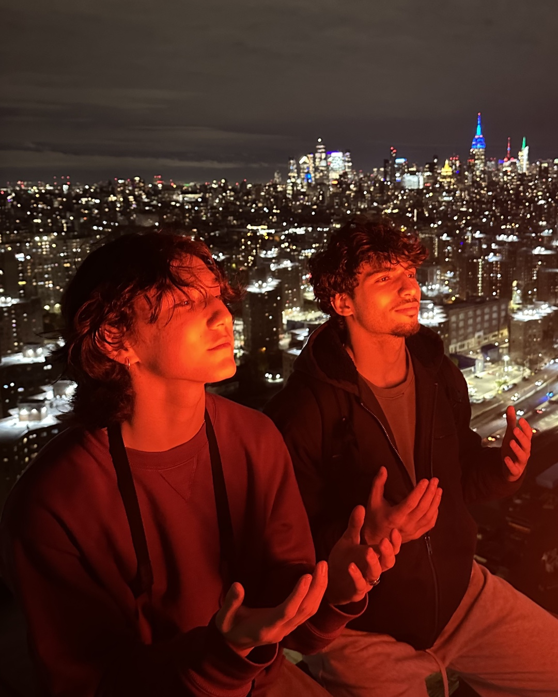

## Every lame party | Background

Growing up in Chicago, some of my biggest inspirations were music videos, Pharrell's Frontin' with Jay-Z, and the movies of the mid nineties. That whole creative canon: parties full of beautiful girls and cool artists, great music playing, dancing, freestyling, so much swag and artistry in one room. I looked around and I didn't see that anywhere.

In high school I didn't go to many parties. I was known as an old soul, reading, writing, working out, asleep early, awake early, and that became part of my identity to other people. But I never felt boring. It's that the parties I did go to were so lame. The music would be bad, nobody would be dancing, the people weren't interesting. It felt alienating: there's nothing here that sees my soul, and it isn't even fun. It was more fun to hang out with friends and work on something and dance in a living room. So at every one of those parties I would sit there and note what I would do differently. What songs I would play. What would have made this so much fun. I had all these ideas.

 

## Selfish and generous | Motivation

The Art Movement was born out of a desire I'd call selfish and generous at the same time. Selfish because I was making the event I wanted to go to: the experiences I wanted to have, the music I wanted to hear, the people I wanted to spend time with. Generous because I wanted everyone there to leave feeling enriched, with their soul fuller than when they arrived, and to have had so much fun.

I think those two things are related. A lot of what passes for fun is destructive, to the body, to the self, chemically. I wanted a night that was creative instead: fulfilling and epic and happy, and one that brings you closer to yourself rather than away from yourself. Not an escape. An invitation to who you are.

## The name | Concept

It's named for the movements I grew up reading about, which are a big part of why I moved to New York: the Bauhaus, Basquiat and his circle, A Tribe Called Quest, A$AP Mob, Pharrell and the Neptunes, Jay-Z. Groups of creative kids in one city, congregating, hanging out, making things together.

It's also a play on words, because the night itself moves. It runs in two halves. First, downstairs, quiet: four young artists demo their work and tell the story behind it, to set the culture of the room as creativity, connection, sharing ideas, and self-expression. People arrive to an open bar of wine and tea, find the friends who invited them, get introduced to strangers by mutual friends, and loosen up in a calm setting where you can actually talk. Then, once everyone has listened and connected, the night moves upstairs to the roof, and the music takes over. The order matters. You form the connections in an open and inviting setting before you're invited to dance and express that energy.

## Paper before party | Design

I did everything on this one: recruited friends, chose the artists, ran the room, and designed every artifact of the night. Before it was a night, it was a deck, a program, and an hour-by-hour rundown of the room. The deck framed the two halves. Each featured artist received a three-page invitation laying out the format, the audience, and what we would provide. The announcement ran as two carousels on Instagram, and I shot the photographs on this page.

        

  

         

          

I asked Jaden Clemons to co-host. We had a conversation about the interconnectedness of a tree and a forest, I gave him the idea, and I edited the video of him talking about it as part of the rollout.

## Impact

It was my first time doing anything like this, and the night went about ninety-five percent aligned with the best case I was aiming for. Many people told me it was the best event they had been to in New York. Many friends were made, and what people kept saying was that they felt happy. It was beautiful.

What I took from it: along with creating cool objects, I can create cool experiences, and I learned viscerally that those are related. The process behind different mediums is related, and it translates. At least in my experience. I would love to continue.

## Four artists downstairs | The night

May 9th, 2026, at Verci in Flatiron. 350 people RSVP'd and 250 came. For the first hour or two the room was open and people talked. Then four artists across four disciplines, a photographer, a poet, a sculptor, and myself as a product designer, each took the room for ten minutes and shared their work and where it came from. The poet brought people to tears.

 

## The roof, until late | The roof

At nine the night moved to the roof. A DJ set moved through soul, jazz, R&B, and electronic, with open microphones and instruments. Freestyles, cyphers, dancing until late.

